# Daily Expense Tracker

## Overview

This is a daily expense tracker with advanced features for improved financial planning and insights. The system empowers users with tools to manage daily expenses, set budgets, and gain valuable insights into their spending habits.

## Technology Used

- PHP 8.1.17
- MySQL
- XAMPP (Apache)
- Bootstrap 4.5
- HTML, CSS, JavaScript

## Prerequisites

Before you begin, ensure you have the following installed:

- [XAMPP](https://www.apachefriends.org/index.html)
- Web browser (e.g., Chrome, Firefox)

## Installation

1. Clone the repository to your local machine:

   ```bash
   git clone https://github.com/yourusername/expense-tracker.git

## For Running the Project
1. Start XAMPP and ensure Apache and MySQL services are running.
2. Copy the project files to the web server's root directory (e.g., htdocs in XAMPP).
3. Open config.php and update the database connection details after creating a database `expense_tracker`:
   ```bash
    $servername = "localhost";
    $dbusername = "root";
    $dbpassword = "";
    $dbname = "expense_tracker";
4. Open your web browser and navigate to `http://localhost/expense-tracker`.

## Project Structure
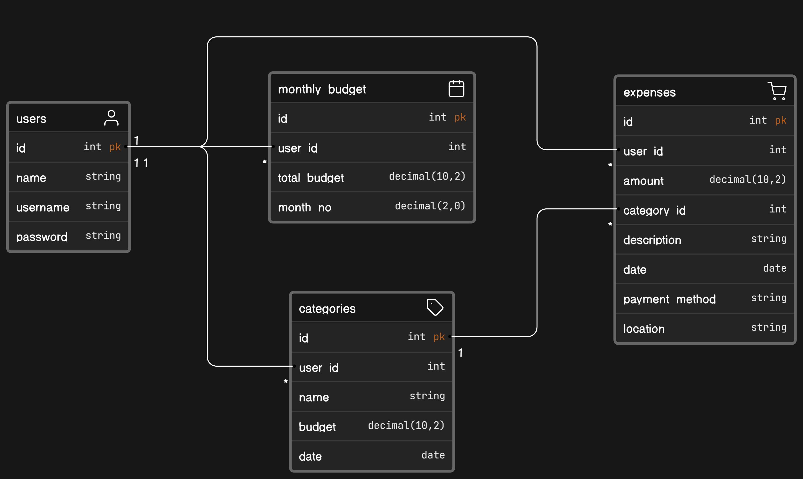

## Demo
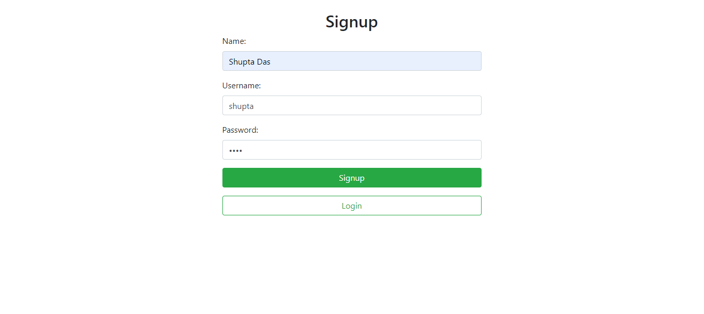
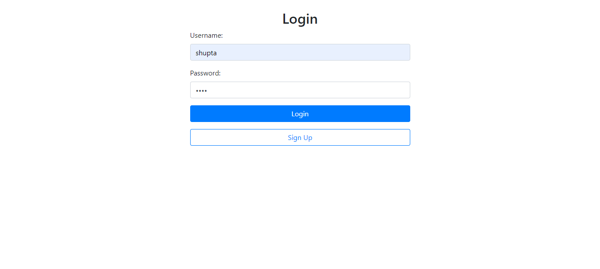
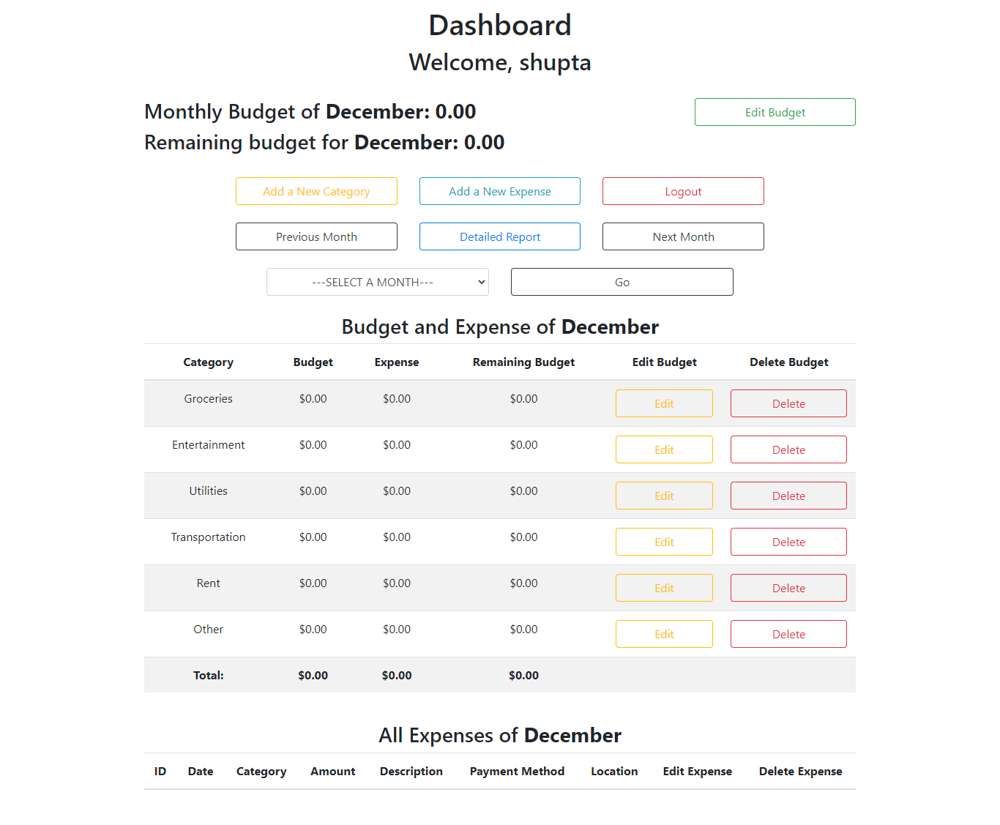
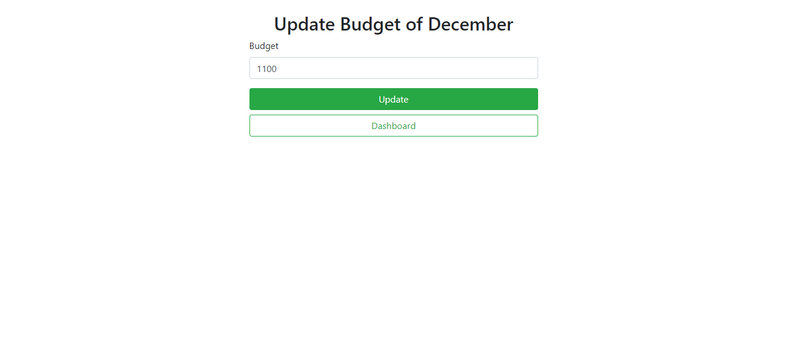
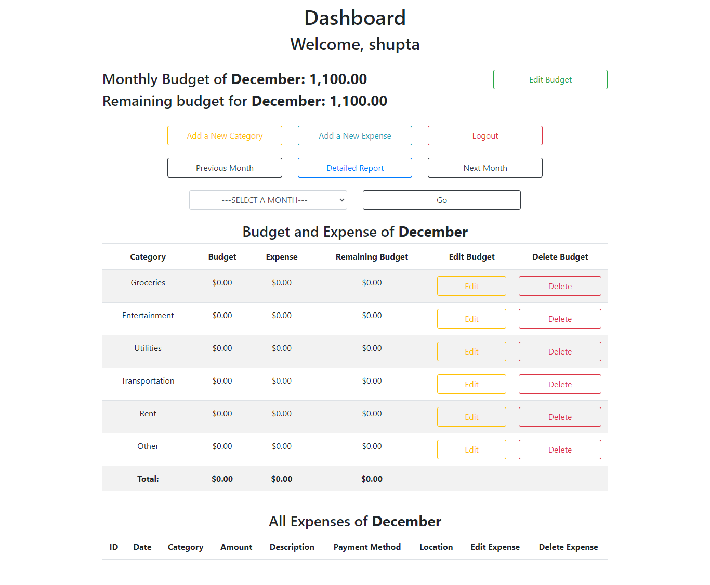
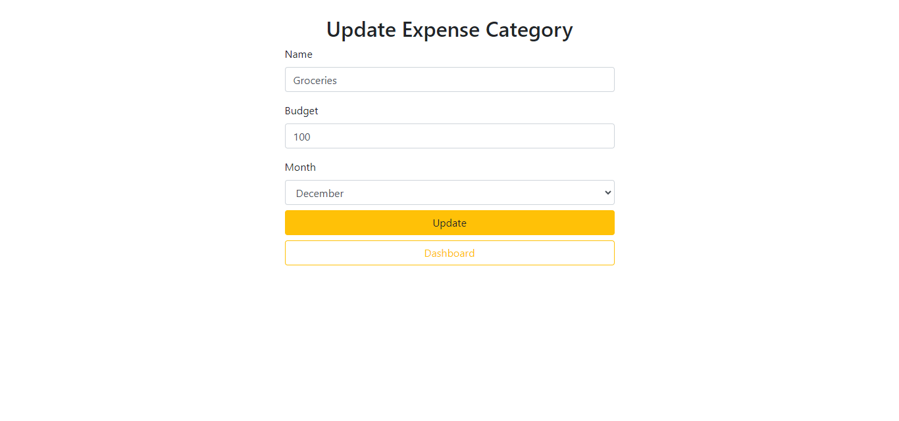
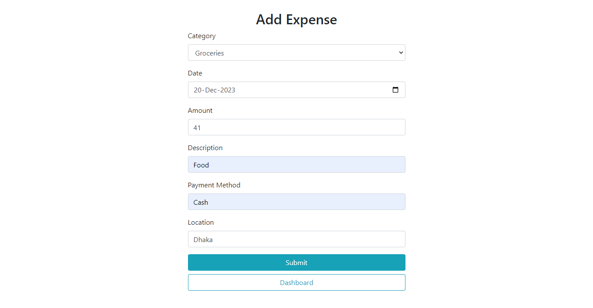
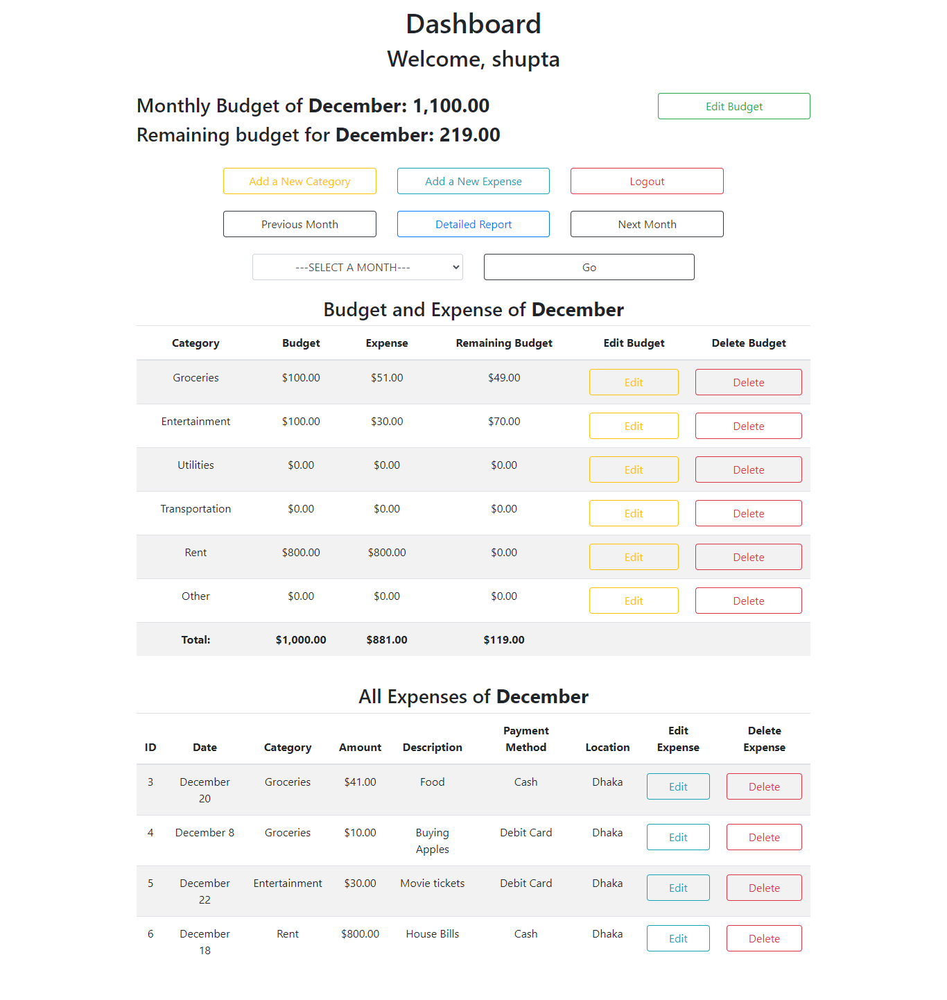
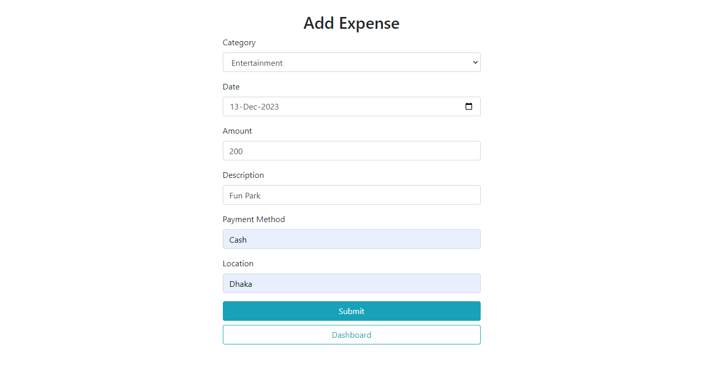
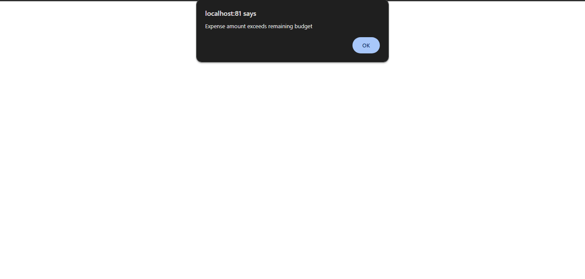
